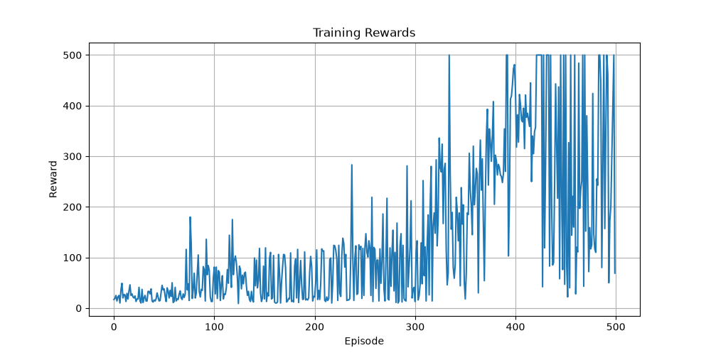

## 👨‍💻 Author

**Abhishek Thakur**

**GitHub:** https://github.com/Abthakur-hub

---

# 🎯 CartPole DQN using PyTorch

A Deep Q-Network (DQN) implementation built with **PyTorch** to solve the **CartPole-v1** environment from **Gymnasium**. This project demonstrates how a reinforcement learning agent learns to balance a pole on a moving cart using **Deep Q-Learning**, **Experience Replay**, and **Target Networks**.

---

## 📌 Overview

This project trains an intelligent agent to solve the CartPole-v1 environment by learning an optimal policy through trial and error. The implementation is built from scratch using PyTorch and follows the standard Deep Q-Network (DQN) algorithm.

---

## 🚀 Features

- ✅ Deep Q-Network (DQN)
- ✅ Experience Replay Buffer
- ✅ Target Network
- ✅ Epsilon-Greedy Exploration
- ✅ Model Checkpoint Saving
- ✅ Reward Curve Visualization
- ✅ Gameplay Recording
- ✅ Modular & Clean Project Structure
- ✅ Built with PyTorch and Gymnasium

---

## 🛠️ Tech Stack

- Python 3.11
- PyTorch
- Gymnasium
- NumPy
- Matplotlib
- ImageIO
- MoviePy
- tqdm

---

## 📂 Project Structure

```text
CartPole-DQN/
│
├── checkpoints/
│   └── best_model.pth
│
├── models/
│   └── dqn.py
│
├── utils/
│   ├── replay_buffer.py
│   └── plot.py
│
├── videos/
│
├── config.py
├── train.py
├── test.py
├── record.py
├── reward_plot.png
├── requirements.txt
├── README.md
└── .gitignore
```

---

## ⚙️ Installation

### 1. Clone the repository

```bash
git clone https://github.com/Abthakur-hub/CartPole-DQN.git
cd CartPole-DQN
```

### 2. Create a Virtual Environment

#### macOS / Linux

```bash
python3 -m venv venv
source venv/bin/activate
```

#### Windows

```bash
python -m venv venv
venv\Scripts\activate
```

### 3. Install Dependencies

```bash
pip install -r requirements.txt
```

---

## ▶️ Train the Agent

Run the training script:

```bash
python train.py
```

The trained model will automatically be saved in:

```text
checkpoints/best_model.pth
```

---

## 🧪 Test the Trained Model

```bash
python test.py
```

The trained agent will play the CartPole environment using the saved model.

---

## 🎥 Record Gameplay

Generate a gameplay recording:

```bash
python record.py
```

The recorded video will be saved inside the `videos/` folder.

---

## 📊 Training Results

Training automatically generates a reward graph.

### Reward Curve



---

## 🧠 Deep Q-Network Architecture

```
State (4)

        │

        ▼

Linear (4 → 128)

        │

      ReLU

        │

        ▼

Linear (128 → 128)

        │

      ReLU

        │

        ▼

Linear (128 → 2)

        │

        ▼

Q-Values
```

---

## 📈 Hyperparameters

| Parameter | Value |
|-----------|--------|
| Environment | CartPole-v1 |
| Learning Rate | 0.001 |
| Discount Factor (γ) | 0.99 |
| Replay Buffer Size | 10000 |
| Batch Size | 64 |
| Episodes | 500 |
| Maximum Steps | 500 |
| Target Network Update | Every 10 Episodes |
| Epsilon Start | 1.0 |
| Epsilon End | 0.01 |
| Epsilon Decay | 0.995 |

---

## 📌 Future Improvements

- Double DQN
- Dueling DQN
- Prioritized Experience Replay
- TensorBoard Integration
- Hyperparameter Optimization
- Soft Target Network Updates
- Multi-Environment Support

---


## ⭐ Support

If you found this project helpful, consider giving it a ⭐ on GitHub.

---
